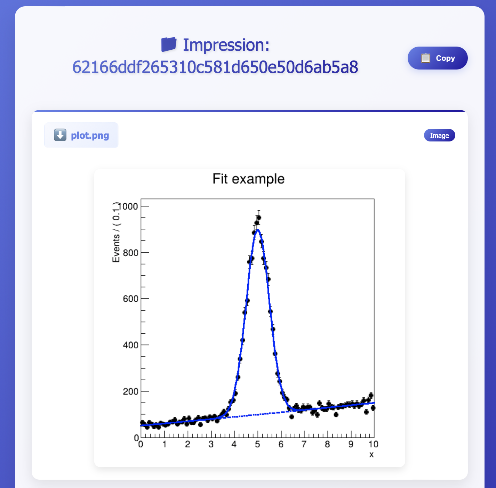

==================
Basic Example: 01
==================

This repository is a demonstration project that includes two main components:

* **Generation (Gen)**: Initial data production.
* **Fitting (Fit)**: Statistical analysis and modeling.

The workflow is executed using **REANA** as the runner backend.
Follow these steps to clone the repository and execute the workflow within the Celebi environment.

1. Clone the Repository
-----------------------

.. code-block:: bash

   git clone https://github.com/CelebiProjects/demo-basic-01.git
   cd demo-basic-01

2. Enter the Celebi Environment
-------------------------------

Initialize and enter the **Celebi shell**:

.. code-block:: bash

   celebi use .   # Use this legacy project
   celebi

3. Verify DITE Connection
-------------------------

Check the current status to ensure the DITE connection is active:

.. code-block:: bash

   ls

If DITE is connected, the output should display:

.. code-block:: text

   >>>> DITE: [connected]

To check the DITE setting, use:

.. code-block:: bash

   dite

*Note: If this is your first time, configure the DITE endpoint:*, for example:

.. code-block:: bash

   set-dite localhost:3315

4. Check Available Runners
--------------------------

List the registered runners to confirm availability:

.. code-block:: bash

   runners

If no runner is registered, you can add one by running:

.. code-block:: bash

   register-runner

And you should also help change the requested runner for running the workflow:

.. code-block:: bash

   set-runner [runner_name]

5. Submit the Workflow
----------------------

Finally, submit the workflow to the runner for execution:

.. code-block:: bash

   submit [runner_name]

This command will make the objects impressed, and then submit the workflow to the selected runner (REANA in this case).

6. Monitor the Workflow
----------------------
You can monitor the status of your work with

.. code-block:: bash

   status

7. Retrieve Results
--------------------
Once the workflow is complete, retrieve the results using:
.. code-block:: bash

   collect

This will download the output files generated by the workflow to your DITE storage.

8. View the Output
--------------------
You can now view the output files.
.. code-block:: bash

   view

This will display the results in your browser like this:

Congratulations!
You have now successfully executed the basic workflow using Celebi and REANA!

.. note::

   The example is adapted from the REANA demo example.
